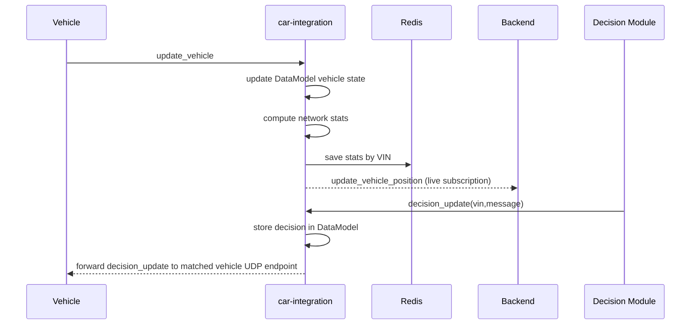

# Car-Integration Deep Summary (reco variant)

Scope: This summary covers [reco/car-integration](reco/car-integration) only.

## 1) System Role

This service is the UDP hub between vehicles and processor modules (backend, decision module, and extra processors).

Primary responsibilities:

1. Accept vehicle telemetry over UDP.
2. Maintain in-memory shared state (vehicles, decisions, connections).
3. Serve subscriptions (live or periodic updates) to processor clients.
4. Forward decision commands back to vehicles by VIN.
5. Compute/store per-vehicle network statistics in Redis.

Main entry points:

- [reco/car-integration/main.go](reco/car-integration/main.go)
- [reco/car-integration/services/communication/connection_manager.go](reco/car-integration/services/communication/connection_manager.go)
- [reco/car-integration/services/communication/connection.go](reco/car-integration/services/communication/connection.go)
- [reco/car-integration/services/communication/datamodel.go](reco/car-integration/services/communication/datamodel.go)
- [reco/car-integration/services/communication/subscriptions.go](reco/car-integration/services/communication/subscriptions.go)

## 2) Runtime Topology

The process starts one shared DataModel and four UDP listeners:

- port 6060: processor connection (decision-module)
- port 5050: processor connection (backend)
- port 4040: vehicle connection (cars/simulator)
- port 4041: extra processor connection

All listeners share the same in-memory DataModel object, so updates from any port become globally visible to all subscriptions.

Also started:

- Redis initialization
- Sentry logger initialization
- pprof HTTP server on localhost:3030

## 3) Protocol Behavior

### Processor-side datagrams handled

- connect -> acknowledge
- keepalive -> acknowledge
- ping -> acknowledge
- subscribe/unsubscribe -> subscription lifecycle + acknowledge
- decision_update -> save decision in DataModel and forward to matched vehicle connection by VIN

### Vehicle-side datagrams handled

- ping -> acknowledge
- update_vehicle -> telemetry ingest, network stats update, Redis write, DataModel update, optional decision subscription creation

## 4) Data and Subscription Model

DataModel contains:

- Vehicles by VIN
- VehicleDecisions by VIN
- Vehicle connections by ID and by VIN
- Condition variables for live update signaling

Subscription modes:

- live-updates: sends update_vehicle_position when vehicle condition variable signals
- periodic-updates: sends vehicles or network-statistics on interval
- decision-update: intended push decision stream per VIN

## 5) End-to-End Flows

## 6) Operational Strengths

- Clear split between connection manager, connection handlers, and DataModel.
- Shared model enables low-latency fanout to multiple processors.
- Live and periodic subscription modes are both implemented.
- VIN-based direct forwarding for decisions exists and is simple.
- Network statistics are computed near ingress and cached in Redis.

## 7) Key Findings and Risks

### P0 (correctness / reliability)

1. ID mapping bug in DataModel vehicle connection index
- In [reco/car-integration/services/communication/datamodel.go](reco/car-integration/services/communication/datamodel.go), new vehicles increment NextVehicleId but never assign that ID into the saved vehicle struct before writing VehicleConnectionsById[savedVehicle.Id].
- Effect: connection-by-ID map can collapse to key 0 and overwrite entries.

2. Decision update timestamp comparison logic is broken
- In UpdateVehicleDecision, map lookup boolean is named err and logic compares new timestamp to itself rather than prior stored timestamp in [reco/car-integration/services/communication/datamodel.go](reco/car-integration/services/communication/datamodel.go).
- Effect: stale-decision filtering is effectively incorrect.

3. Mutation side-effect in WriteDatagram for safe=false
- [reco/car-integration/services/communication/connection.go](reco/car-integration/services/communication/connection.go) mutates connection.ClientAddress.Port=12345 (and elsewhere IP is also mutated).
- Effect: shared connection state can drift unexpectedly across sends.

### P1 (behavioral drift / protocol inconsistencies)

1. decision subscription datagram type mismatch
- SendDecisionUpdates builds UpdateVehicleDecisionDatagram with BaseDatagram type update_vehicle_position in [reco/car-integration/services/communication/subscriptions.go](reco/car-integration/services/communication/subscriptions.go).
- Effect: consumers may parse/route incorrectly.

2. decision subscription path appears inconsistent with direct forwarding path
- ProcessorConnection already forwards decision_update directly to vehicle in [reco/car-integration/services/communication/connection.go](reco/car-integration/services/communication/connection.go).
- In parallel, vehicle-side decision subscription is still created (except one VIN), causing duplicated or divergent mechanisms.

3. hardcoded VIN/service routing logic
- VINs C4RF...0001 and C4RF...0002 are mapped to som/sam and port 12345 in [reco/car-integration/services/communication/connection.go](reco/car-integration/services/communication/connection.go).
- Effect: environment-specific behavior and fragile scaling beyond two vehicles.

4. inconsistent index deduplication
- Processor path drops datagrams by index; vehicle path has that check commented out in [reco/car-integration/services/communication/connection.go](reco/car-integration/services/communication/connection.go).
- Effect: possible duplicate/out-of-order telemetry acceptance.

### P2 (maintainability / ops)

1. keepalive timeout disabled at startup
- All managers are created with timeout 0 in [reco/car-integration/main.go](reco/car-integration/main.go).

2. database package exists but is currently unused by main flow
- [reco/car-integration/services/database/database.go](reco/car-integration/services/database/database.go) is not initialized from main.

3. logger DSN hardcoded in source
- [reco/car-integration/services/logger/Logger.go](reco/car-integration/services/logger/Logger.go).

4. no service health endpoint
- Redis health function exists but is not exposed over HTTP.

## 8) Behavior Notes Worth Highlighting

- Vehicle subscription to decision updates is skipped for VIN C4RF117S7U0000001 in [reco/car-integration/services/communication/connection.go](reco/car-integration/services/communication/connection.go).
- SendDecisionUpdates additionally guards against UpdatedVehicleVin == C4RF117S7U0000001 in [reco/car-integration/services/communication/subscriptions.go](reco/car-integration/services/communication/subscriptions.go).
- Network-statistics periodic response packs api.NetworkStatisticsDatagram with BaseDatagram type update_vehicles in [reco/car-integration/services/communication/subscriptions.go](reco/car-integration/services/communication/subscriptions.go).

## 9) Suggested Immediate Hardening Plan

1. Fix vehicle ID assignment in DataModel and verify VehicleConnectionsById usage.
2. Correct decision timestamp comparison logic to compare new vs saved decision timestamp.
3. Remove mutable address side-effects in WriteDatagram; use a local target address copy.
4. Unify decision delivery mechanism (either direct forwarding or subscription stream, not conflicting variants).
5. Replace hardcoded VIN/service mapping with config-driven routing.
6. Re-enable/standardize index deduplication on vehicle ingest path.
7. Externalize Sentry DSN and networking overrides via env variables.
8. Add minimal health endpoint with Redis and listener status.

## 10) Environment and Deployment Assumptions

- Redis expected at redis:6379.
- UDP listeners bind to 0.0.0.0 on fixed ports 4040/4041/5050/6060.
- pprof served on localhost:3030.
- Decision forwarding currently assumes target port 12345 and optional docker DNS names som/sam.
